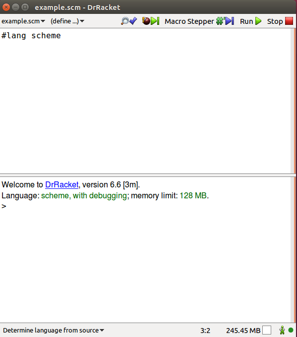
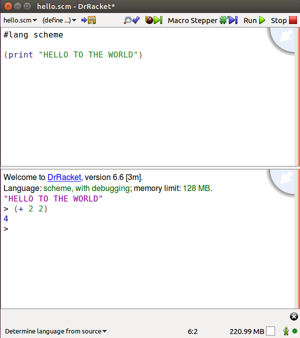

# learning-functional-programming

A starter's guide for learning how to solve problems in a functional way.

## Rationale

In today's big-data world, we have to deal with enormous amounts of data by
doing work in parallel. The common term for this is Map-Reduce (see more at
https://en.wikipedia.org/wiki/MapReduce). The concepts of mapping and reducing
have been around for over 60 years, and these are at the core of functional
programming.

## Setup

Install Racket (the user interface is called DrRacket) from
https://download.racket-lang.org/

Open the DrRacket executable (`bin/drracket` or `drracket.exe`). In the top of
the window, put the line

```scheme
#lang scheme
```



You can hit run and you're now using Scheme! You can save this file as
`hello.scm` or any other name you would like. Note that the `.scm` file
extension is typically used for Scheme source code.

## Using DrRacket

The top of the window is a file editor. You can save anything that's up there.
The bottom of the window is called a REPL. It reads what you write (like a
terminal), evaluates it, prints the result, and continues in that loop (REPL =
Read Eval Print Loop).



Here I ran 

```scheme
(print "HELLO TO THE WORLD")
```

from the file editor, then I typed

```scheme
(+ 2 2)
```

into the REPL and hit ENTER. This evaluated the procedure `+` with the arguments
`2` and `2` to get the result `4`.


## What's Next?

Now our development environment is set up. We're ready to write code in a
functional way! The most highly recommended book for learning Functional
Programming is called the Structure and Interpretation of Computer Programs (or
SICP for short). The full text is available at
https://mitpress.mit.edu/sicp/full-text/book/book-Z-H-4.html

Since this book was written for academia, the language can be a bit...academic.
However, the first two chapters are really good at teaching how to program
without keeping track of state. What I mean by "state" is something that is
modified during execution or otherwise variable.

This book is broken up very well into sections so you can learn at your own pace
and read as little at a time as needed. In order to get the most out of this,
you should make your best attempt at the exercises before turning to the online
resources. Should you get stuck on an exercise, there are working solutions
available on the Scheme Wiki (http://community.schemewiki.org/?sicp-solutions).

Some of the exercises should be skipped because they are too much math and/or
don't really add value. A list of these will be provided here.

- Chapter 1
Skip 1.5, 1.7, 1.13, 1.19, 1.20, 1.26-28, 1.29, 1.35, 1.37-39, 1.45

## TODO

- Add which exercises should be skipped because they're too mathy or just don't
  add value
  
- Add more functional programming resources? Maybe some other LISPs?
